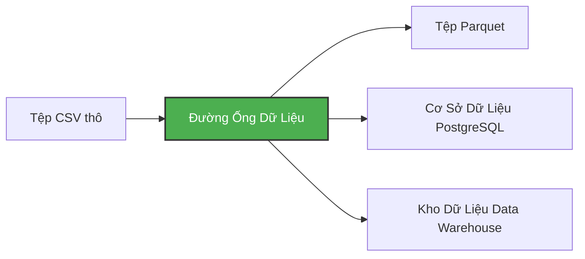

# Môi Trường Ảo Và Đường Ống Dữ Liệu (Virtual Environments & Data Pipelines)

Một **đường ống dữ liệu (data pipeline)** là một tiến trình hoặc dịch vụ tiếp nhận dữ liệu đầu vào (input), thực hiện các biến đổi cần thiết và xuất ra dữ liệu đầu ra (output). Ví dụ: đọc một tệp CSV thô, làm sạch và chuẩn hóa dữ liệu, sau đó lưu trữ vào một bảng trong cơ sở dữ liệu PostgreSQL.



Trong phần thực hành này, chúng ta sẽ xây dựng các đường ống dữ liệu thực tế nhằm:
- Tải dữ liệu CSV từ internet.
- Chuyển đổi và làm sạch dữ liệu với thư viện `pandas`.
- Nạp dữ liệu vào cơ sở dữ liệu PostgreSQL để phục vụ truy vấn phân tích.
- Xử lý dữ liệu theo từng khối (chunking) để xử lý mượt mà các tệp dữ liệu dung lượng lớn hàng trăm megabyte đến gigabyte mà không làm tràn RAM.

---

## Xây Dựng Một Pipeline Đơn Giản (Creating a Simple Pipeline)

Hãy bắt đầu bằng việc tạo một đường ống đơn giản. Đầu tiên, tạo một thư mục `pipeline` và tạo tệp `pipeline.py` bên trong:

```python
import sys
print("arguments", sys.argv)

day = int(sys.argv[1])
print(f"Running pipeline for day {day}")
```

Bây giờ hãy bổ sung thêm thư viện pandas để biến đổi dữ liệu:

```python
import pandas as pd

df = pd.DataFrame({"A": [1, 2], "B": [3, 4]})
print(df.head())

df.to_parquet(f"output_day_{sys.argv[1]}.parquet")
```

---

## Tại Sao Phải Dùng Môi Trường Ảo? (Why Virtual Environments?)

Để chạy script trên, chúng ta cần thư viện `pandas` và `pyarrow`. Nếu chạy lệnh cài đặt toàn cục:

```bash
pip install pandas pyarrow
```

Các thư viện này sẽ được cài thẳng vào hệ thống máy tính của bạn (global environment). Điều này rất dễ gây xung đột phụ thuộc (dependency conflict) khi các dự án khác nhau lại đòi hỏi các phiên bản thư viện hoặc phiên bản Python khác nhau.

Vì vậy, giải pháp tiêu chuẩn là sử dụng **Môi trường ảo (Virtual Environment)** — một môi trường Python độc lập và tách biệt hoàn toàn dành riêng cho từng dự án.

---

## Sử Dụng `uv` - Trình Quản Lý Gói Python Hiện Đại Và Siêu Tốc

Trong khóa học này, chúng ta sử dụng **`uv`** — trình quản lý dự án và gói Python thế hệ mới được viết bằng ngôn ngữ Rust. `uv` nhanh gấp 10-100 lần so với `pip` truyền thống và tự động quản lý môi trường ảo cực kỳ gọn gàng.

Cài đặt `uv`:

```bash
pip install uv
```

Khởi tạo một dự án Python mới với `uv` sử dụng Python 3.13:

```bash
uv init --python=3.13
```

Lệnh này sẽ tự động sinh tệp `pyproject.toml` để quản lý các gói phụ thuộc và tệp `.python-version`.

### So Sánh Các Phiên Bản Python

Kiểm tra đường dẫn và phiên bản Python trong môi trường ảo so với Python toàn cục:

```bash
# Python bên trong môi trường ảo của dự án
uv run which python  
uv run python -V

# Python toàn cục của hệ điều hành
which python        
python -V
```

Bạn sẽ thấy hai môi trường hoàn toàn tách biệt.

### Cài Đặt Gói Phụ Thuộc (Adding Dependencies)

Cài đặt `pandas` và `pyarrow` vào dự án:

```bash
uv add pandas pyarrow
```

`uv` sẽ tự động tải, cài đặt vào môi trường ảo và ghi nhận phiên bản vào tệp `pyproject.toml`.

### Thực Thi Đường Ống Dữ Liệu (Running the Pipeline)

Bây giờ chúng ta có thể chạy script thông qua `uv`:

```bash
uv run python pipeline.py 10
```

Kết quả hiển thị trên màn hình:

* `['pipeline.py', '10']`
* `Running pipeline for day 10`
* Tệp `output_day_10.parquet` được tạo ra thành công.

---

## Cấu Hình Git (.gitignore)

Script trên sinh ra tệp nhị phân nén Parquet. Trong Data Engineering, chúng ta không commit các tệp dữ liệu lớn vào Git repository. Hãy thêm định dạng này vào file `.gitignore`:

```
*.parquet
```
